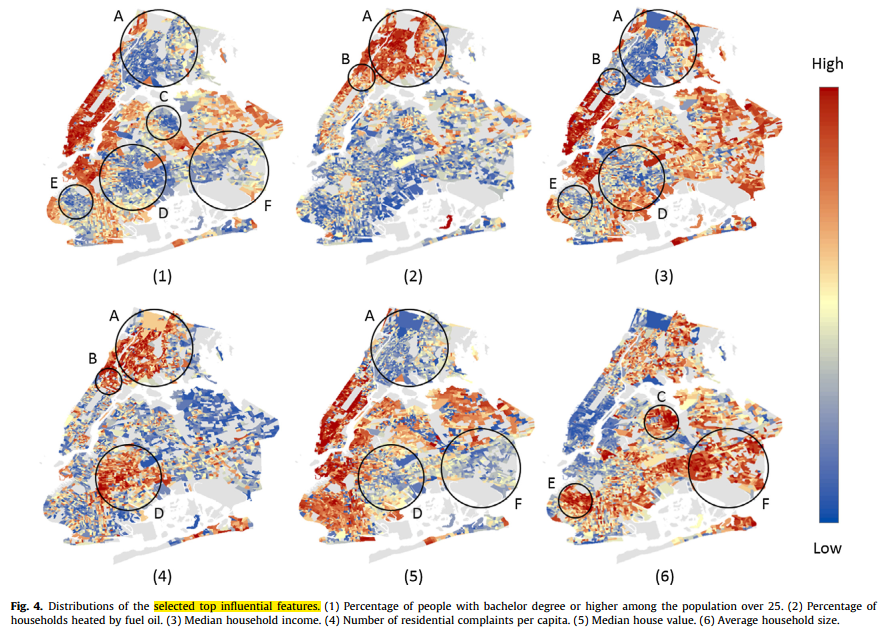

[TOC]

# papers
## Identifying the Influential Features on the Regional Energy Use Intensity of Residential Buildings Based on Random Forests-2016

- bg;place the topic in the setting, current gaps(linear modeling and insuffi consideration of particular feats)
- proposal; apply Random Forests on modeling the relation bet. regional energy use intensity(EUI) and other 171 possible features, then identify **the influential features** using the out-of-bag estimation in RF.
- core components; data(open data, 3608 multi-family residential buildings in NY, 171 feats each), baseline(SVM, lasso, Multiple linear reg), modeling, analysis and vis.

- potential use; mainly for gov decision-making strategy.
- comments; application contribution: 1) apply a non-linear ML algorithm for energy use domain. 2) compare the RF w. other baseline methods(MLR,Lasso,SVM) and make the feature importance analysis.

## Estimation of the Building Energy Use Intensity in the Urban Scale by Integrating GIS and Big Data Technology
- bg;
- proposal;
- core components;
- comments;

## Improving Air Quality Prediction Accuracy at Larger Temporal Resolutions Using Deep Learning and Transfer Learning Techniques
- bg;
- proposal;
- core components;
- comments;
